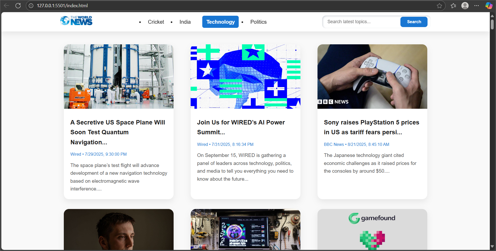

# 📰 News Website using HTML, CSS, and JavaScript  

A professional and responsive **News Website** built with **HTML, CSS, and JavaScript**. The project dynamically fetches news articles from an API and presents them in a clean, user-friendly interface without relying on external frameworks.  

## 🚀 Features  
- Dynamic news fetching using APIs  
- Clean and modern user interface  
- Responsive design for all screen sizes  
- Search functionality for filtering news  
- Organized news cards for better readability  

## 🛠️ Tech Stack  
- **HTML5** – Structure and layout  
- **CSS3** – Styling and responsiveness  
- **JavaScript (ES6+)** – Logic, API calls, and interactivity  

## 🌐 Live Demo

The News Website is deployed and fully functional.  
Experience it live here: [https://enchanting-blini-a5552f.netlify.app/](https://enchanting-blini-a5552f.netlify.app/)

